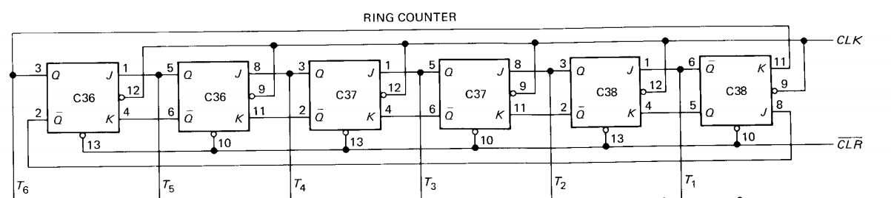

# SAP-1 architecture

## Program counter

## Input and MAR

## RAM

## Instruction Register

## Controller-Sequencer
### Control Word CON
The control word determines how the registers will react to the next positive CLK edge.

* Cp - Increments program counter. Only active in Increment State (T2)
* Ep - Enables output for the Program Counter module. Only active in Address State (T1)
* ~Lm
* ~CE

* ~Li
* ~Ei
* ~La
* Ea

* Su
* Eu
* ~Lb
* ~Lo

## Accumulator

## Adder-Substracter

## Display

## Ring Counter
#### These are the schematics for the ring counter. It produces 6 different T-states (3 for the fetch cycle, 3 for execution cycle).

#### Timing signals

# Instruction Set
| Mnemonic      | Opcode           | Operation  |
| ------------- |:----------------:| ----------:|
| LDA           | 0000              | Load RAM data into accumulator |
| ADD           | 0001              | Add RAM data to accumulator |
| SUB           | 0010              | Subtract RAM data from accumulator |
| OUT           | 1110              | Load accumulator data into ouput register |
| HLT           | 1111              | Stop processing |

* LDA - Load the accumulator
* ADD - Add
* SUB - Substraction
* OUT - Output
* HLT - Halt

## Fetch cycle
Fetch cycle is composed of 3 T-states:
### Address State (T1)
During this state, the Program Counter (PC) is transferred to the Memory Address Register (MAR) via the system bus. Both Ep and ~Lm are active in this state.

### Increment State (T2)
The program counter (PC) is incremented. Only the Cp bit is active.

### Memory State (T3)
The addressed RAM instruction (currently on the bus) is transferred from the memory to the instruction register. The active control bits are ~CE and ~Li.

## Execution cycle
### LDA routine
### ADD routine
### SUB routine
### HLT routine

