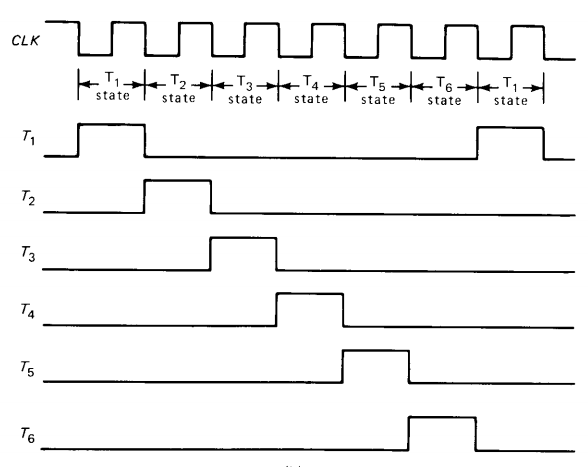

# SAP v1 architecture

## Control Word CON

* Cp - 
* Ep - Enables output for the program counter module. Only active in Address State (T0)
* ~Lm
* ~CE

* ~Li
* ~Ei
* ~La
* Ea

* Su
* Eu
* ~Lb
* ~Lo

## Ring Counter
#### These are the schematics for the ring counter. It produces 6 different T-states (3 for the fetch cycle, 3 for execution cycle).

#### Timing signals

## Instruction Set
* LDA - Load the accumulator
* ADD - Add
* SUB - Substraction
* OUT - Output
* HLT - Halt

## Fetch cycle
Fetch cycle is composed of 3 T states (generated by the ring counter)
### Address State
During 
### Increment State
### Memory State

## Execution cycle
### LDA routine
### ADD routine
### SUB routine
### HLT routine
