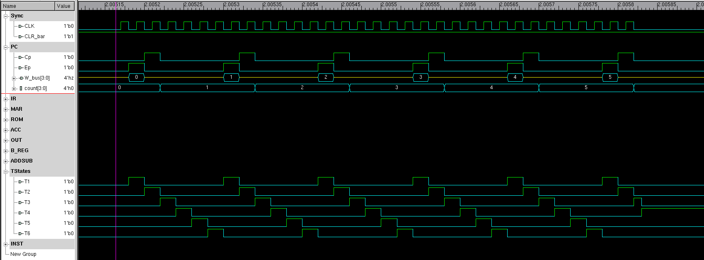
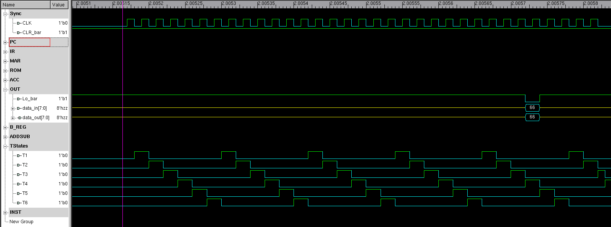

# FPGA Design for SAP-1

There are few architectural changes to make SAP-1 architecture FPGA-compliant. One of them is that we cannot have 3-state buses in our FPGA design. To overcome this limitation, we use multiplexed inputs using the appropiate Control Word signals.

### Makefile
We use the [VCS simulator](https://www.synopsys.com/verification/simulation/vcs.html) from Synopsys. 

Compiling and launching the simulation is done via make commands.
```
make
make run
```

### VCS flags
 ##### -lca 
 
 #####  -t ps 
 
 #####  -sverilog 
 Enables the extensions to the Verilog language in the Accellera SystemVerilog specification
 
 #####  -debug_all 
 Enables DVE and UCLI debugging inluding line stepping.
 
 #####  -timescale=time_unit/time_precision
 By default if some source files contain the ‘timescale compiler directive and others don’t, and the ones that don’t precede the ones that do on the command line, this is an error condition and VCS halts compilation. This option enables you to specify the timescale for the source files that don’t contain this compiler directive and precede the source files that do. Do not include spaces when specifying the arguments to this option.
 
 #####  +lint=PCWM 
 Port connect width mismatch
 
 #####  +lint=TFIPC-L
 Too few instance port connections
 
 #####  +lint=GCWM 
 Gate connection width mismatch
 
 #####  +lint=CAWM
 Continuous Assignment width mismatch
 
 #####  -o
 Specifies the name of the executable file. In UNIX the default is simv.


## Program Counter


## Instruction Register


## MAR


## ROM


## Accumulator


## B Register


## Adder/Subtractor


## Output Register


## Decoded Instruction


