# SAP-1 architecture
* Bus-organized computer.
* All register outputs to the W bus are three-state.

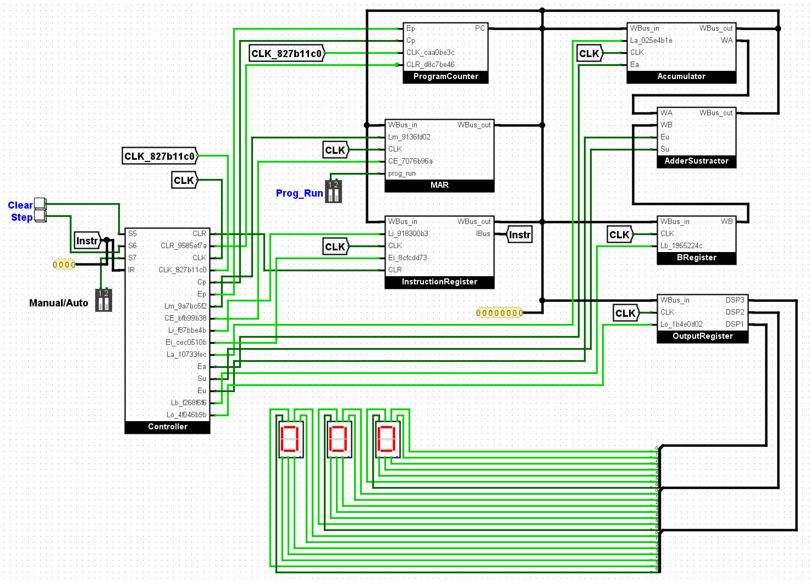

## Program counter
* The PC is stored at the beginning of the memory with the first instruction at binary address 0000. 
* The PC module counts from 0000 to 1111.
* Its job is to send the memory address of the next instruction to be fetched and executed.

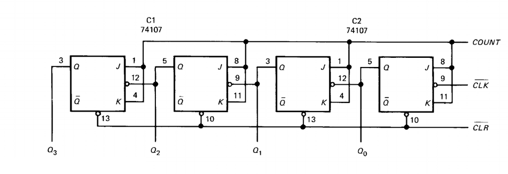

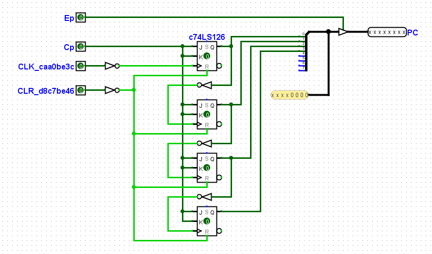

## Input and MAR
* It includes the address and data switch registers allow you to send 4 address bits and 8 data bits to the RAM.
* During a computer run, the address in the *PC* is latched into the MAR. Later, the MAR applies this 4-bit address to the RAM where a read operation is performed.

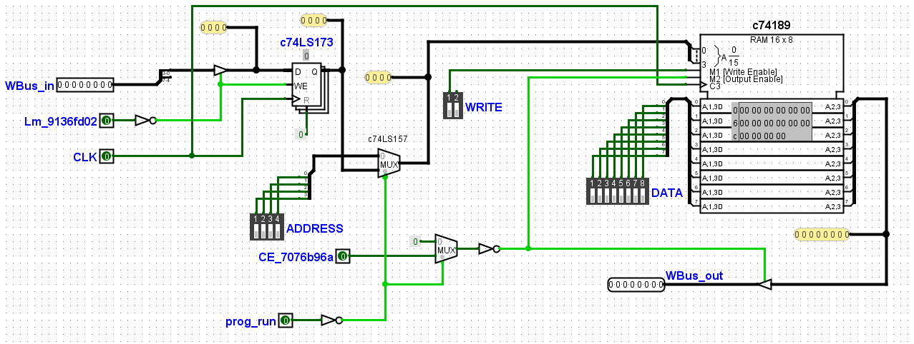

## RAM
* The RAM is a 16 x 8 static TTL RAM.
* The RAM receives 4-bit addresses from the MAR and a read operation is performed, so the instruction or data word stored in the RAM is palced on the W bus.

## Instruction Register
* To fetch an instruction from the memory the computer does a memory read operation. At the same time, the instruction register is set up for laoding on the next positive clock edge.
* the contents of the *IR* are split into two nibbles. The upper nibble is a two-state output that goes directly to the Controller-Sequencer. The lower nibble is a three-state output that is read onto the W bus when needed.

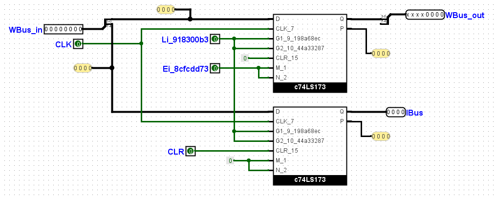

## Controller-Sequencer
The control unit is the key to a computer's automatic operation. It generates the control words that fetch an execute each instruction, and while each instruction is processed, the computer passes through different timing states (T-states) which are preriods during which register contents change.

Notice that a positive CLK edge occurs midway through each T state.

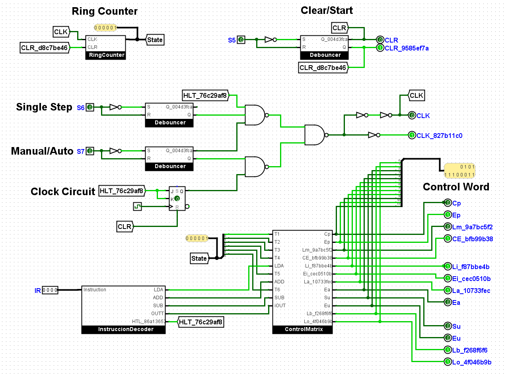

### Control matrix

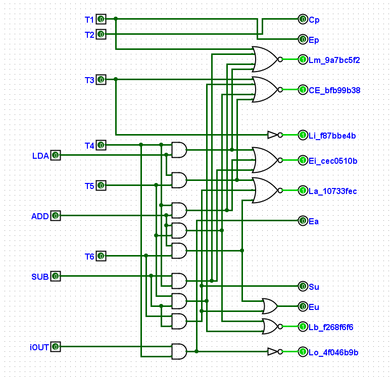

### Instruction decoder

### Ring Counter
These are the schematics for the ring counter. It produces 6 different T-states (3 for the fetch cycle, 3 for execution cycle).

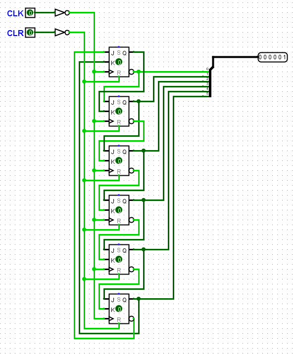

### Timing signals

### Control Word CON
The control word determines how the registers will react to the next positive CLK edge.

* CP - Increments program counter. Only active in Increment State (T2).
* EP - Enables output for the Program Counter module. Only active in Address State (T1).
* ~LM - Latch lower W bus nibble on the MAR.
* ~CE - Chip enable for the ROM module.

* ~LI - Latch W bus word on the instruction register.
* ~EI - Enable instruction register output.
* ~LA - Latch W bus word on the accumulator.
* EA - Enable accumulator ouput..

* SU - Add or sustract flag.
* EU - Enable adder/sustractor output.
* ~LB - Latch W bus word on the B register.
* ~LO - Latch W bus word on the Output register.

## Accumulator
* The Accumulator *A* is a buffer register tat stores intemediate answers during a computer run.
* The accumulator has two outputs. The two-state output goes directly to the adder-subtracter and the three-state output goes to the W bus.

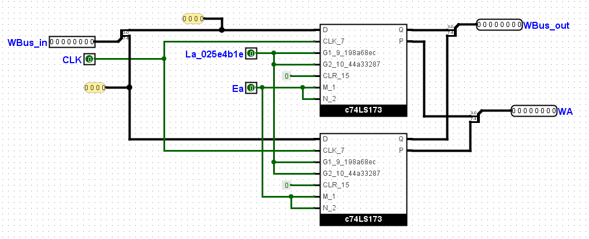

## Adder-Substracter
* SAP-1 uses a 2's complement adder-subtracter. When SU is low, the sum output is:

**S = A + B**

* When SU is high, the difference appears:

**S = A + B'**

* The adder-subtracter is *asynchronous* (unclocked); this means its contents can change as soon as the input words change.
* When EU is high, these contents appear on the W bus.

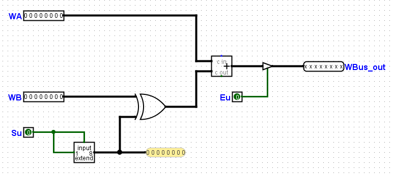

## B register
* The B register is another buffer register used in arithmetic operations.
* A low ~LB and positive clock edge load the word on the W bus into the B register.
* The two-state output drives the adder-subtracter, supplying the number to be added or subtracted from the contents of the accumulator.

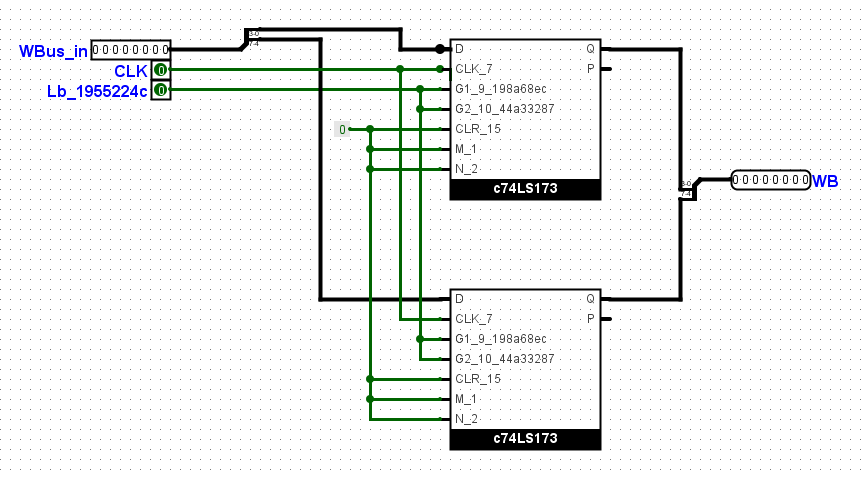

## Output register
* At the end of the computer run, the accumulator contains the answer to the problem being solved. At this point we need to transfer the answer to the outside world.
* When EA is high and ~LO is low, the next positive clock edge loads the accumulator word into the ouput register.

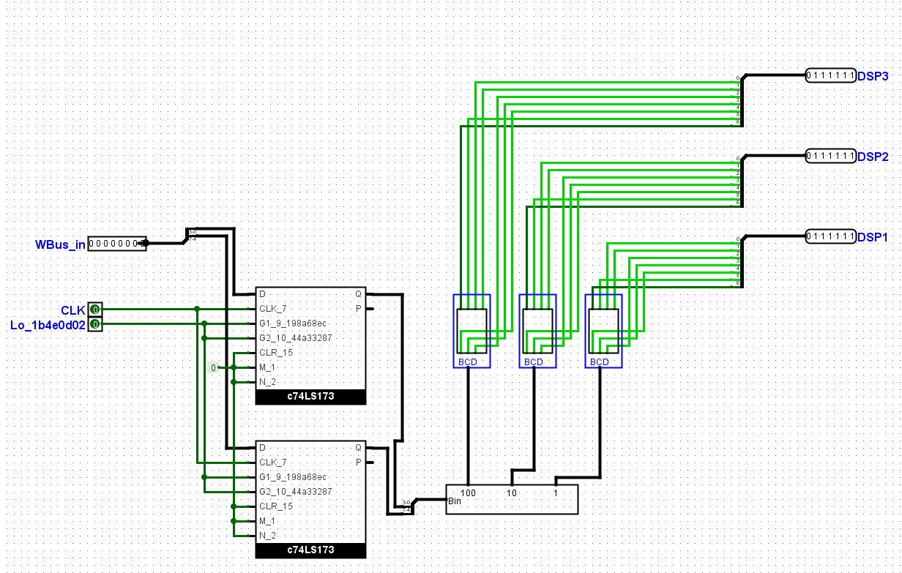

## Display
* The binary dispaly is a row of eight light-emmitting diodes. 
* because each LED connects to one flip-flop of the output port, the binary display shows us the contents of the output port.

# Instruction Set
| Mnemonic      | Opcode           | Operation  |
| ------------- |:----------------:| ---------- |
| LDA           | 0000              | Load RAM data into accumulator |
| ADD           | 0001              | Add RAM data to accumulator |
| SUB           | 0010              | Subtract RAM data from accumulator |
| OUT           | 1110              | Load accumulator data into ouput register |
| HLT           | 1111              | Stop processing |

# Fetch cycle
### Address State (T1)
During this state, the Program Counter (PC) is transferred to the Memory Address Register (MAR) via the system bus. Both EP and ~LM are active in this state.

### Increment State (T2)
The program counter (PC) is incremented. Only the CP bit is active.

### Memory State (T3)
The addressed RAM instruction (currently on the bus) is transferred from the memory to the instruction register (IR). The active control bits are ~CE and ~LI.

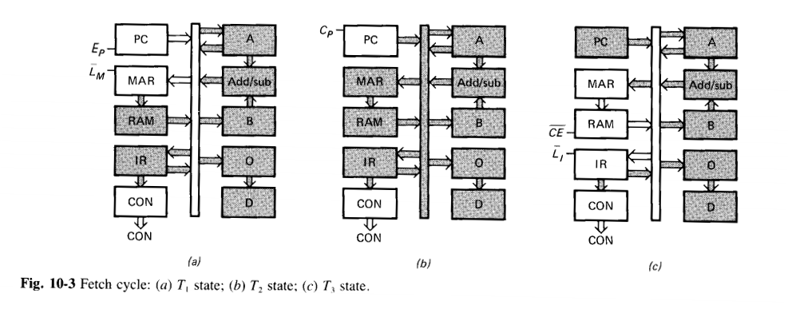

# Execution cycle
On the next three states (T4, T5, T6), the register transfers during the execution depend on the particular instruction being executed.
### LDA routine
Example instruction being loaded into IR: LDA 9H

 **IR** = 0000 1001

* During the T4 state, the instruction field (0000) goes to the controller-sequencer, where it is decoded. Also, the address field (1001) is loaded into MAR. ~EI abd ~LM are both active in this state.
* During T5, ~CE and ~LA go low. This means that the addressed data word in the RAM will be loaded into the accumulator on the next positive clock edge.
* T6 is a no-operation state for the LDA routine, in which all registers are inactive.

### ADD routine
Example instruction being loaded into IR: ADD BH

 **IR** = 0001 1011
 
* During the T4 state, the instruction field (0001) goes to the controller-sequencer, where it is decoded. Also, the address field (1011) is loaded into MAR. ~EI abd ~LM are both active in this state.
* Control bits ~CE and ~LB are active during the T5 state, this allows the addressed RAM word to set up the B register.
* During the T6 state, EU and ~LA bits are active; therefore, the adder-subtracter set up the accumulator.

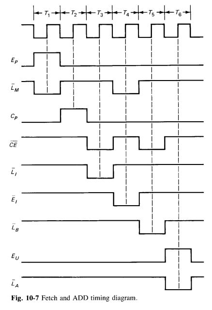

### SUB routine
The SUB routine is similar to the ADD routine, but during the T6 state, a high SU is also sent to the adder-subtracter.

### OUT routine
* T4: The instruction field goes to the controller-sequencer for decoding, then the controller sequencer sends out the control word needed to load the accumulator contents (EA) into the output register ~LO.
* T5: No-op
* T6: No-op

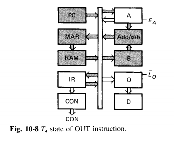

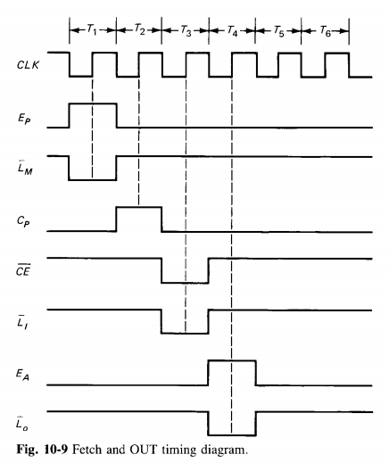

### HLT routine
* HLT does not require a control routine because no registers are involved in the execution of an HLT instruction.
* When the **IR = 1111 XXXX**,  the instruction field 1111 signals the controller-sequencer to stop processing data.
* The controller-sequencer stops the computer by turning off the clock.

